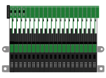
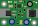
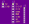

# Fritzing parts

Some [Fritzing](http://fritzing.org) parts, I've made for my projects. I only use Fritzing as a pictorial layout drawing (not for schematic or PCB) so it only has the breadboard view with the associated connectors

## Parts

### Metec Braille line 20 cell

### Metec DC-DC converter

### 8pin adapter for Metec Braille line 20 cell

## Import a part

To import a part in Fritzing, go to "Mine" on the right drawer then import and pick the .fzpz file located in each part folder

## About creating a Fritzing part

The process is to create the svg with a software like Inkscape and importing it in the "part editor" of Fritzing. The svg should have a group `<g id="breadboard"></g>` (also a `<g id="icon"></g>` for the icon) and identify the connector that are mapped in Fritzing by connectorXpin in svg with `id="connectorXpin"`. Note that in Fritzing it shows `connector1` in the connector tab of "part editor" but it should be `id="connector1pin"` inside the svg (note the suffix `pin`)

In Inkscape, save as Optimized SVG before importing to Fritzing. If svg has text, the font size can't be set with `styles` attributes but with `font-size` and not in `px`, for instance in Metec Braille line 20 cell part, replace `font-size:1.76px` with `font-size:2` before importing.

Part file reference : https://github.com/fritzing/fritzing-app/wiki/2.1-Part-file-format

## License

The MIT License (MIT) Copyright (c) 2018 Bertrand Martel